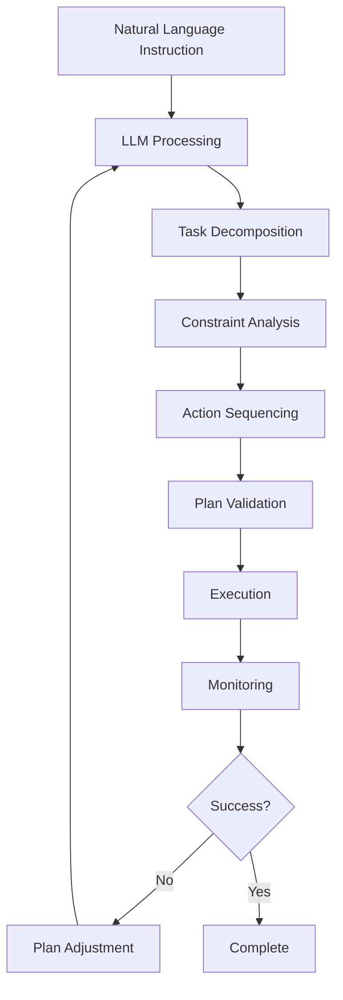

# Language-Driven Planning

## Learning Objectives

By the end of this chapter, you should be able to:
- Understand how LLMs can decompose complex natural language instructions into executable task sequences
- Explain cognitive planning pipelines that translate high-level goals to low-level actions
- Implement basic task decomposition for robotic systems
- Evaluate the effectiveness of language-driven planning approaches

## Introduction

Language-driven planning represents a sophisticated approach to robotic task execution, where large language models (LLMs) serve as cognitive planners that decompose high-level natural language instructions into sequences of executable robotic actions. This chapter explores how LLMs can bridge the gap between human intention and robotic behavior.

## Cognitive Planning Architecture

Language-driven planning involves a multi-step process that transforms high-level goals into executable actions:

1. **Goal Interpretation**: Understanding the high-level objective from natural language
2. **Task Decomposition**: Breaking the goal into smaller, manageable sub-tasks
3. **Constraint Analysis**: Identifying environmental and physical constraints
4. **Action Sequencing**: Ordering tasks based on dependencies and feasibility
5. **Execution Planning**: Converting tasks to specific robotic actions

### Planning Pipeline Example

```
"Go to the kitchen and bring me a red cup"
→ [Goal Interpretation]
→ [Task Decomposition: navigate → identify object → grasp → return]
→ [Constraint Analysis: path planning, object recognition parameters]
→ [Action Sequencing: based on dependencies]
→ [Execution: ROS 2 action sequence]
```

## LLM Integration for Planning

Large language models excel at understanding the structure and intent of natural language, making them ideal for task decomposition. The integration process involves:

- **Prompt Engineering**: Crafting effective prompts that guide the LLM toward structured planning
- **Context Provisioning**: Providing environmental and robot state information
- **Output Parsing**: Converting LLM responses into executable task sequences
- **Validation**: Ensuring generated plans are feasible and safe

### Example Planning Prompt Structure

```
Context: You are a cognitive planner for a humanoid robot. The robot is in the living room and needs to complete tasks. Current capabilities include navigation, object recognition, and manipulation.

Goal: {user_instruction}

Please decompose this goal into a sequence of executable tasks. For each task, specify:
- Task type (navigation, perception, manipulation, interaction)
- Description
- Required parameters
- Dependencies on other tasks

Output format: JSON array of task objects
```

## Task Decomposition Strategies

Effective language-driven planning requires understanding different decomposition strategies:

### Hierarchical Decomposition
Breaking complex tasks into a hierarchy of sub-tasks, where higher-level tasks are composed of lower-level actions.

### Sequential Decomposition
Decomposing tasks into linear sequences where each step depends on the completion of the previous step.

### Parallel Decomposition
Identifying tasks that can be executed in parallel to optimize efficiency.

## Integration with Navigation and Perception

Language-driven planning must coordinate with:
- **Navigation Systems**: For path planning and movement execution
- **Perception Systems**: For object recognition and environment understanding
- **Manipulation Systems**: For grasping and interaction tasks

### ROS 2 Integration Example

```python
class LanguagePlanner:
    def __init__(self):
        self.llm_client = LLMClient()
        self.navigation_client = NavigationClient()
        self.perception_client = PerceptionClient()
        self.manipulation_client = ManipulationClient()

    def plan_from_language(self, instruction):
        # Get plan from LLM
        task_sequence = self.llm_client.generate_plan(instruction)

        # Execute each task in sequence
        for task in task_sequence:
            self.execute_task(task)

    def execute_task(self, task):
        if task.type == "navigation":
            self.navigation_client.navigate_to(task.target_location)
        elif task.type == "perception":
            self.perception_client.identify_object(task.object_spec)
        elif task.type == "manipulation":
            self.manipulation_client.grasp_object(task.object_id)
```

## Practical Implementation

### Setting Up Language Planning

To implement language-driven planning, you'll need:

1. **LLM Access**: API access to a capable language model
2. **Environment Context**: Information about the robot's environment and capabilities
3. **Action Mapping**: System to convert LLM outputs to robotic actions
4. **Validation Layer**: To ensure plans are executable and safe

### Example Planning Workflow



## Challenges and Considerations

### Ambiguity Resolution
Natural language often contains ambiguities that need to be resolved through context or clarification.

### Execution Monitoring
Plans need to be monitored for success and adjusted when tasks fail or the environment changes.

### Safety Constraints
All generated plans must respect safety constraints and physical limitations of the robot.

## Hands-On Exercise

Create a language-driven planning system that can decompose a complex instruction like "Go to the kitchen, find a red cup, pick it up, and bring it to the living room" into a sequence of executable tasks. Implement the system to work with a simulated robot environment.

## Summary

Language-driven planning leverages the cognitive capabilities of LLMs to bridge the gap between human intentions and robotic actions. By decomposing complex natural language instructions into executable task sequences, we can create more intuitive and capable robotic systems.

## Key Takeaways

- LLMs serve as cognitive planners that decompose high-level goals into executable actions
- Effective planning requires context about the environment and robot capabilities
- Plans must be validated and monitored for successful execution
- Integration with ROS 2 enables practical implementation of language-driven planning

## References and Further Reading

- [Large Language Models for Robotics](https://arxiv.org/abs/2310.08820)
- [Task and Motion Planning](https://www.cs.utexas.edu/~pstone/Papers/bib2html-links/IJRR08.pdf)
- [ROS 2 Navigation System](https://navigation.ros.org/)