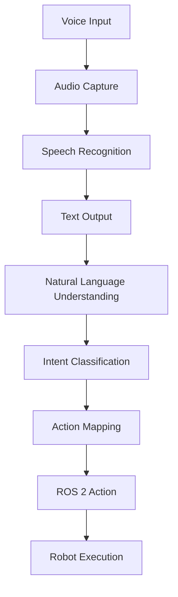

# Voice-to-Action Interfaces

## Learning Objectives

By the end of this chapter, you should be able to:
- Understand how speech recognition systems convert voice commands to structured actions
- Explain the integration between speech recognition and ROS 2 action servers
- Describe the flow from voice input to robotic action execution
- Implement basic voice-to-action mapping for robotic systems

## Introduction

Voice-to-Action interfaces represent a fundamental capability in human-robot interaction, allowing natural communication between humans and robots through spoken language. This chapter explores how speech recognition systems like Whisper can be integrated with robotic action systems to create intuitive interfaces for controlling humanoid robots.

## Speech Recognition and Processing

Voice-to-action systems begin with converting spoken language into text that can be processed by AI systems. The process involves several stages:

1. **Audio Capture**: Microphones capture the spoken command
2. **Preprocessing**: Audio is cleaned and prepared for recognition
3. **Speech-to-Text**: The audio is converted to text using models like Whisper
4. **Intent Recognition**: The text is analyzed to identify the intended action

### Example Architecture

```
[User Speaks Command] → [Microphone] → [Audio Processing] → [Speech Recognition] → [Text Output]
```

## Natural Language Understanding

Once speech is converted to text, the system must understand the intent behind the command. This involves:

- **Intent Classification**: Determining what the user wants to accomplish
- **Entity Extraction**: Identifying specific objects, locations, or parameters
- **Command Structuring**: Converting natural language to structured commands

For example, the command "Move forward" might be processed as:
- Intent: `navigation`
- Action: `move_forward`
- Parameters: `{distance: 1.0, speed: 0.5}`

## Integration with ROS 2

The structured commands from natural language processing need to be converted into ROS 2 actions that can control the robot. This involves:

- **Action Mapping**: Converting high-level commands to specific ROS 2 action calls
- **Parameter Translation**: Converting natural language parameters to ROS 2 message fields
- **Execution**: Sending the action request to the appropriate ROS 2 action server

### ROS 2 Action Interface Example

```python
# Example of how voice commands might trigger ROS 2 actions
import rclpy
from rclpy.action import ActionClient
from geometry_msgs.msg import Twist

class VoiceActionMapper:
    def __init__(self):
        self.action_client = ActionClient(self, NavigationAction, 'navigate_to_pose')

    def process_voice_command(self, command_text):
        # Parse command and convert to ROS 2 action
        if "move forward" in command_text.lower():
            self.execute_navigation_action(distance=1.0)
```

## Practical Implementation

### Setting Up Voice Recognition

To implement voice-to-action interfaces, you'll need:

1. **Audio Input**: A microphone or audio input device
2. **Speech Recognition Model**: Such as Whisper for local processing
3. **Natural Language Processor**: To understand command intent
4. **ROS 2 Interface**: To convert commands to robotic actions

### Example Voice Command Processing



## Hands-On Exercise

Implement a basic voice-to-action system that can recognize and execute simple commands like "Move forward", "Turn left", and "Stop". Use the ROS 2 navigation stack to execute these commands on a simulated robot.

## Summary

Voice-to-action interfaces provide a natural way for humans to interact with robots. By combining speech recognition, natural language processing, and ROS 2 action systems, we can create intuitive interfaces that make robotics more accessible.

## Key Takeaways

- Voice-to-action systems convert spoken language into robotic actions through multiple processing stages
- Integration with ROS 2 enables voice commands to control real robotic systems
- Natural language understanding bridges the gap between human communication and robotic action

## References and Further Reading

- [ROS 2 Action Architecture](https://docs.ros.org/en/rolling/Concepts/About-Actions.html)
- [Speech Recognition with Whisper](https://openai.com/research/whisper)
- [Human-Robot Interaction Research](https://www.hrijournal.org/)